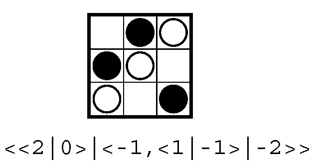

ScoringGames
============

The <b>Scoring Games Calculator</b> is a Haskell set of modules to manipulate a new game universe, 
the Scoring Universe, representing a certain class of games with scoring. The Universe is flexible enough to include the standard [CGT Conway Universe](http://en.wikipedia.org/wiki/Surreal_number).

The main module is **Scoring** with all the data structures and functions to perform operations over scoring game values.

Given a ruleset $R$, any valid position $p \in R$ is represented abstractly by module **Position**. This module can then be instanciated over many concrete rulesets (eg, Dots'n'Boxes) each one of those rulesets are codified on their respective modules. This project already includes some game implementations, namely **Dots'n'Boxes**, **Kobber** and **Diskonnect**.

The next picture shows the value of a Kobber position:

Download the [user guide](https://github.com/jpneto/ScoringGames/blob/master/userGuide/userGuide.pdf?raw=true) for a more detailed introduction/tutorial.

## Installation

1. Download an Haskell system, eg, the [Haskell Platform](https://www.haskell.org/platform/)

2. Clone this [project](https://github.com/jpneto/ScoringGames) or just [download as a ZIP](https://github.com/jpneto/ScoringGames/archive/master.zip) from GitHub, unzip it and load into the Haskell interpreter (eg, in Windows select Winghci)

_This is still in a beta version_